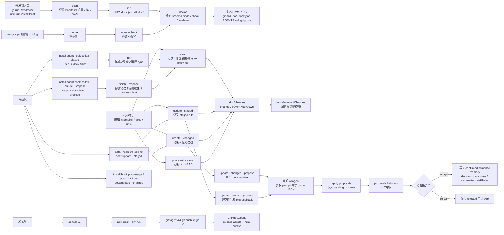

# 当前项目 CLI 工作流程使用手册

项目：`docx`

目标：说明当前项目中 `docx` CLI 的使用路径，包括命令有向图、详细场景和可直接复用的案例命令。

## 1. 项目定位

`docx` 是一个 Go CLI，用来为任意项目创建和持续维护 AI 可读的项目上下文。

它会在目标仓库中生成：

- `.docx.json`：CLI 配置文件，记录上下文目录、schema version 和入口文件。
- `.doc/`：项目上下文目录，包含项目摘要、模块上下文、变更记录、proposal、决策、错题和 agent 读取协议。
- `AGENTS.md` / `CLAUDE.md` 托管区块：告诉 AI agent 从 `.doc/index.json` 开始渐进读取上下文。
- `.gitignore` / git hook 托管区块：忽略本地缓存，并可自动触发上下文同步。

核心原则：

- generated facts 可以由 CLI 自动刷新。
- decisions、mistakes、module summary、riskRules 等长期语义记忆必须经过用户确认或 proposal accept。
- `docx` 不会主动调用 AI；它只生成 task 文件，当前 agent 产出 JSON 后再由 `docx apply ...` 应用。

## 2. CLI 命令有向图



## 3. 命令地图

| 阶段 | 命令 | 典型用途 | 主要产物或检查点 |
|---|---|---|---|
| 开发入口 | `go run ./cmd/docx --help` | 从源码直接运行 CLI。 | 确认命令分发和 help 输出可用。 |
| 本地安装 | `npm run install:local` | 从当前源码构建二进制并安装 npm wrapper。 | 本地可运行的 `docx` 命令。 |
| 项目发现 | `docx scan` / `docx scan --json` | 查看项目会被识别成什么，不写语义记忆。 | manifest、语言、框架、入口、测试、模块候选。 |
| 初始化 | `docx init` / `docx init --interactive` | 创建 `.docx.json` 和 `.doc/`。 | 上下文目录、入口文件托管区块、`.gitignore` 托管区块。 |
| Agent 初始化 task | `docx init --accept-candidates --summarize` | 接受模块候选，并生成摘要 task。 | `.doc/tmp/init-summary-input.json` 和 prompt。 |
| 应用初始化摘要 | `docx apply init .doc/tmp/init-summary-output.json` | 应用当前 agent 生成的项目/模块摘要。 | `project.summary` 和 `module.summary`。 |
| 同步工作区 | `docx sync` | agent 完成代码变更后记录 staged、unstaged 和 untracked 模块改动。 | change record、module facts、`.doc/tmp` follow-up。 |
| agent 收尾 | `docx finish` | Codex / Claude Code Stop hook 的安全入口。 | 有 confirmed module 改动时运行 `sync`；无改动时不写旧记录。 |
| 显式更新 | `docx update --staged` / `--changed` / `--since <ref>` | 按明确 diff 范围记录变更。 | `.doc/changes/*` 和模块 `recentChanges`。 |
| Agent 语义建议 | `docx update --changed --propose` | 为长期语义记忆生成 proposal task。 | `.doc/tmp/proposals-*`。 |
| 应用 agent proposal | `docx apply proposals .doc/tmp/proposals-output.json` | 把 agent 输出落为 pending proposal。 | `.doc/proposals/*`。 |
| 人工确认 | `docx proposals list/show/accept/reject` | 审阅、接受或拒绝语义更新。 | confirmed memory 或 rejected 审计记录。 |
| 索引维护 | `docx index` / `docx index --check` | merge 后或手动编辑 `.doc/` 后恢复索引健康。 | changes/proposals/decisions/mistakes index。 |
| 健康检查 | `docx doctor` / `docx doctor --strict` | 检查配置、schema、索引、capabilities 和 hook。 | 健康报告；strict 可作为 CI gate。 |
| migration | `docx migrate` | 显式执行 schema migration。 | 更新 `.docx.json` / context metadata。 |
| hook | `docx install-hook pre-commit` | 安装托管 git hook。 | `.git/hooks/*` 中的 docx 托管区块。 |
| agent hook | `docx install-agent-hook codex` / `claude` | 安装项目级 agent lifecycle hook。 | `.codex/hooks.json` 或 `.claude/settings.json` 中的 Stop hook。 |
| 发布检查 | `go test ./...` / `npm pack --dry-run` | 发布前验证 Go 测试和 npm 包内容。 | 测试通过、npm 包内容正确。 |

## 4. 详细场景与案例

### 场景 A：在当前源码仓库调试 CLI

适合修改 `internal/cli` 下的命令实现、help 文案、scanner、index、doctor、hooks 或 proposal 流程。

```bash
go test ./...
go run ./cmd/docx --help
go run ./cmd/docx scan --json
go run ./cmd/docx doctor
```

案例：你修改了 `internal/cli/help.go`，需要确认 help 输出仍然覆盖所有命令。

```bash
go test ./internal/cli
go run ./cmd/docx --help
go run ./cmd/docx update --help
go run ./cmd/docx proposals --help
```

检查点：

- `cli.go` 中注册的命令应能在 `help.go` 中找到对应 help。
- README 的命令说明应与 CLI help 保持一致。
- 涉及命令行为变化时，应补充或更新 `internal/cli/*_test.go`。

### 场景 B：把 `docx` 接入一个已有仓库

目标是在目标仓库中生成 AI 可读上下文，让后续 AI agent 从 `.doc/index.json` 开始读取，而不是每次扫描整个项目。

```bash
docx scan
docx init --interactive
docx doctor
git add .doc .docx.json AGENTS.md .gitignore
git commit -m "Initialize docx project context"
```

如果 scanner 识别出的模块候选基本可信，可以用自动初始化：

```bash
docx init --accept-candidates --summarize
# 当前 agent 根据 .doc/tmp/init-summary-prompt.md 写出 .doc/tmp/init-summary-output.json
docx apply init .doc/tmp/init-summary-output.json
docx doctor
git add .doc .docx.json AGENTS.md .gitignore
git commit -m "Initialize docx project context"
```

注意：

- `--summarize` 只生成初始化摘要 task，不会自动调用 AI。
- `apply init` 只写项目摘要和模块摘要。
- `riskRules`、`decisions`、`mistakes` 不应在初始化时自动落盘。

### 场景 C：普通功能提交前同步项目上下文

目标是在 commit 前把 staged changes 记录到 `.doc/changes`，并更新受影响模块的 `recentChanges`。

```bash
git add internal/cli/update.go internal/cli/update_test.go
docx update --staged
git add .doc/changes .doc/modules
git commit -m "Improve update change recording"
```

适用判断：

- 已经整理好本次 commit 的边界：用 `docx update --staged`。
- 当前工作区有 agent 刚完成的多文件改动，包含 staged、unstaged 或 untracked：用 `docx sync`。
- 想记录某个范围内的历史差异：用 `docx update --since main` 或 `docx update --since HEAD~1`。

### 场景 D：当前 AI agent 生成语义 proposal

目标是让 AI 帮忙提出长期记忆更新，但最终是否写入仍由人确认。

```bash
docx update --changed --propose
# 当前 agent 读取 .doc/tmp/proposals-prompt.md
# 当前 agent 写出 .doc/tmp/proposals-output.json
docx apply proposals .doc/tmp/proposals-output.json
docx proposals list
docx proposals show <id>
docx proposals accept <id>
```

如果 proposal 的目标文件需要调整：

```bash
docx proposals accept <id> --target .doc/mistakes/testing.md
```

适合生成 proposal 的情况：

- 新增了重要架构决策。
- 修复了一个值得长期记住的反模式。
- 模块职责发生变化。
- 某个测试、迁移或发布风险需要成为 `riskRules`。

不适合直接进入 confirmed memory 的情况：

- 只是普通 bugfix，没有长期语义价值。
- AI 输出缺少证据。
- proposal 把临时实现细节误判成长期架构原则。

### 场景 E：merge 后恢复索引健康

多人协作或分支合并后，`.doc/changes/index.json`、`.doc/proposals/index.json`、`.doc/decisions/index.json`、`.doc/mistakes/index.json` 可能过期。

```bash
docx index
docx index --check
docx doctor --strict
```

案例：合并 teammate 分支后发现 `doctor --strict` 报 index 不一致。

```bash
docx index
git add .doc/changes/index.json .doc/proposals/index.json .doc/decisions/index.json .doc/mistakes/index.json
docx doctor --strict
```

原则：

- 用 `docx index` 重建索引。
- 用 `docx index --check` 做只读验证。
- 不要手动编辑 index 作为长期修复。

### 场景 F：安装 git hook 自动维护上下文

目标是减少忘记运行 `docx update` 的概率。

```bash
docx install-hook pre-commit
docx install-hook post-merge
docx install-hook post-checkout
```

如果希望 pre-commit 同时生成 agent proposal task：

```bash
docx install-hook pre-commit --propose
```

hook 行为：

- `pre-commit`：默认运行 `docx update --staged`。
- `pre-commit --propose`：运行 `docx update --staged --propose`。
- `post-merge`：运行 `docx update --changed`。
- `post-checkout`：运行 `docx update --changed`。

注意：

- hook 使用托管区块，重复安装会刷新托管内容。
- hook 不应该覆盖用户已有 hook 逻辑。
- 团队也可以改用 Husky 或 lefthook 调用 `docx update --staged`。

### 场景 G：安装 agent hook 自动收尾

目标是在 Codex 或 Claude Code 的 Stop 事件自动调用 `docx finish`，让 agent 会话结束时尽量同步项目上下文。

```bash
docx install-agent-hook codex
docx install-agent-hook claude
docx install-agent-hook codex --propose
```

hook 行为：

- `codex`：写入项目级 `.codex/hooks.json`。
- `claude`：写入项目级 `.claude/settings.json`。
- 两者都会在 `Stop` 事件运行 `docx finish`。
- 使用 `--propose` 时，Stop hook 运行 `docx finish --propose`，记录变更后继续创建 proposal task。
- `docx finish` 只有发现 confirmed module 中存在 staged、unstaged 或 untracked 改动时才运行 `docx sync`。

注意：

- 已有 hook 事件会被保留，重复安装不会重复追加。
- agent hook 是可选增强，不会由 `docx init` 自动启用。
- 如果需要长期语义记忆，仍然走 `.doc/tmp` follow-up 或 proposal 审阅流程。

### 场景 H：本地打包安装

目标是在不依赖 GitHub Release 的情况下，从当前工作区构建并安装本地 CLI。

```bash
npm run install:local
docx --help
```

如果不想写入系统级 npm 全局目录：

```bash
DOCX_LOCAL_PREFIX=/tmp/docx-local npm run install:local
/tmp/docx-local/bin/docx --help
```

这个流程会：

1. 从当前工作区执行 `go build ./cmd/docx`。
2. 把二进制放入 npm 包的 `npm/bin-runtime/`。
3. 通过 `npm pack` 生成本地 `.tgz`。
4. 设置 `DOCX_SKIP_DOWNLOAD=1`，避免下载 release 产物。

### 场景 I：发布前检查与正式发布

发布前本地检查：

```bash
go test ./...
npm pack --dry-run
```

正式发布通过 `v*` tag 触发 GitHub Actions：

```bash
git tag v0.1.0
git push origin v0.1.0
```

GitHub Actions 会执行：

1. `go test ./...`
2. `npm pack --dry-run`
3. 构建 macOS、Linux、Windows 的 amd64/arm64 二进制
4. 上传 GitHub Release assets
5. 在满足条件时发布 npm 包

发布前检查点：

- `package.json` 版本与 tag 版本一致。
- release asset 名称与安装脚本和 npm postinstall 预期一致。
- npm Trusted Publishing 已绑定 GitHub Actions workflow。
- 如果要发布 npm，仓库 variable `PUBLISH_NPM=true` 已设置。

## 5. 命令选择速查

| 你现在想做什么 | 优先命令 | 避免误用 |
|---|---|---|
| 只看项目发现结果 | `docx scan` | 不要用 `init` 试探，因为它会写文件。 |
| 第一次接入仓库 | `docx init --interactive` | 不要让 AI 自动写长期决策。 |
| 接受模块候选并生成摘要任务 | `docx init --accept-candidates --summarize` | 不要忘记后续 `docx apply init`。 |
| agent 完成代码改动后同步 | `docx sync` | 不要忽略 `.doc/tmp` follow-up。 |
| agent hook 收尾同步 | `docx finish` | 不要用它替代需要明确 diff 范围的 `update --staged`。 |
| 安装 Codex / Claude Code 收尾 hook | `docx install-agent-hook codex` / `claude` | 不要假设 `init` 会自动启用 hook。 |
| 安装会话结束 proposal hook | `docx install-agent-hook codex --propose` | 会生成 proposal task，但仍需要 `docx apply proposals` 和人工 accept。 |
| 提交前记录 staged diff | `docx update --staged` | 不要混入未暂存改动。 |
| 记录当前未提交改动 | `docx update --changed` | 不要在 commit 边界未整理时直接提交结果。 |
| 生成长期语义建议 | `docx update --changed --propose` | 不要跳过 proposal 审阅。 |
| 接受语义建议 | `docx proposals accept <id>` | 不要接受缺少证据的 proposal。 |
| merge 后索引不健康 | `docx index` | 不要手动编辑 index。 |
| CI 健康检查 | `docx doctor --strict` | 不要只跑普通 `doctor` 后忽略错误状态。 |
| 发布前检查 | `go test ./...` + `npm pack --dry-run` | 不要只依赖 tag workflow 才发现问题。 |

## 6. 执行检查清单

- 修改 CLI 命令后，确认 `internal/cli/cli.go`、`internal/cli/help.go`、`README.zh-CN.md` 的命令说明一致。
- 修改 scanner、update、index、doctor、hooks、proposal 相关逻辑后，运行 `go test ./...`。
- 完成代码改动后，根据边界选择 `docx sync` 或 `docx update --staged`。
- 需要长期语义沉淀时，使用 `update --propose`、`apply proposals`、`proposals accept`，不要让 AI 直接写 confirmed memory。
- merge 或手动编辑 `.doc/` 后，运行 `docx index` 和 `docx doctor --strict`。
- 发布前运行 `go test ./...` 和 `npm pack --dry-run`。
- 发布 tag 前确认 `package.json` 版本、release asset 命名、npm Trusted Publishing 配置。

## 7. 当前项目关键文件

| 文件或目录 | 作用 |
|---|---|
| `cmd/docx/main.go` | CLI 入口，调用 `internal/cli.Run`。 |
| `internal/cli/cli.go` | 命令分发：`init`、`scan`、`sync`、`finish`、`update`、`proposals`、`apply`、`index`、`doctor`、`migrate`、`install-hook`、`install-agent-hook`。 |
| `internal/cli/help.go` | 各子命令 help 文案。 |
| `internal/cli/init.go` | 初始化 `.docx.json`、`.doc/` 和入口文件托管区块。 |
| `internal/cli/update.go` | 记录变更并刷新 affected module context。 |
| `internal/cli/sync.go` | agent 变更后的上下文同步流程。 |
| `internal/cli/finish.go` | agent lifecycle hook 的安全收尾入口。 |
| `internal/cli/agent_hooks.go` | Codex / Claude Code 项目级 hook 安装。 |
| `internal/cli/proposals.go` | proposal list/show/accept/reject。 |
| `internal/cli/ai_init.go` | 应用 AI 初始化摘要。 |
| `internal/cli/ai_update.go` | 应用 AI 语义更新输出。 |
| `internal/cli/index_command.go` / `indexer.go` | 索引重建和检查。 |
| `internal/cli/doctor.go` | 配置、schema、索引、capabilities 和 hook 健康检查。 |
| `internal/cli/hooks.go` | 托管 git hook 安装。 |
| `internal/cli/migrate.go` | schema migration。 |
| `README.zh-CN.md` | 中文安装、命令、端到端案例。 |
| `docs/release.zh-CN.md` | 发布流程、release assets、npm Trusted Publishing。 |
| `docs/hooks.zh-CN.md` | git hook 使用说明。 |
| `docs/ai-proposals.zh-CN.md` | agent proposal 流程说明。 |
